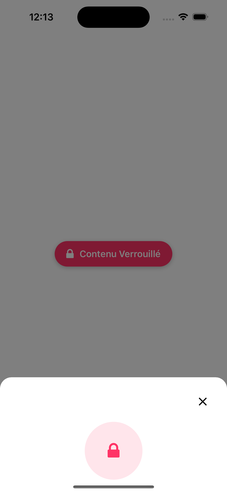

# React Native Unlock Modal

A simple and reusable Unlock Modal component for React Native applications.
<div style="display: flex; gap: 20px; margin-bottom: 20px;">
    
    
    
</div>

## Description

A React Native modal component that provides a clean interface for content unlocking with visual feedback states. Built with TypeScript and Expo Vector Icons.

## Getting Started

### Dependencies

* react >= 16.8
* react-native >= 0.70
* @expo/vector-icons

### Installation

1. Clone the repository:
```bash
git clone https://github.com/joachimdplt/unlock-modal.git
```

2. Install dependencies:
```bash
npm install @expo/vector-icons
```

3. Copy components to your project:
   - `components/UnlockModal.tsx`
   - Use the component as shown in the example

### Usage

```typescript
import React, { useState } from 'react';
import { View, Button } from 'react-native';
import UnlockModal from './components/UnlockModal';

export default function App() {
  const [isVisible, setIsVisible] = useState(false);

  const handleUnlock = async () => {
    // Your unlocking logic here
    await someUnlockingProcess();
  };

  return (
    <View>
      <Button 
        title="Open Modal" 
        onPress={() => setIsVisible(true)} 
      />
      
      <UnlockModal
        isVisible={isVisible}
        onClose={() => setIsVisible(false)}
        onUnlock={handleUnlock}
      />
    </View>
  );
}
```

## Props

| Name | Type | Required | Description |
|------|------|----------|-------------|
| isVisible | boolean | Yes | Controls modal visibility |
| onClose | () => void | Yes | Called when modal is closed |
| onUnlock | () => Promise<void> | Yes | Async function called on unlock |

## Component States

The modal has three states:
1. Initial - Displays a locked state
2. Unlocking - Shows loading state with "Unlocking..." text
3. Unlocked - Displays success state with "Content Unlocked!" message

## Authors

* **Joachim Duplat** - *Initial work*

## License

This project is licensed under the MIT License - see the [LICENSE.md](LICENSE.md) file for details

## Acknowledgments

* React Native
* Expo Vector Icons